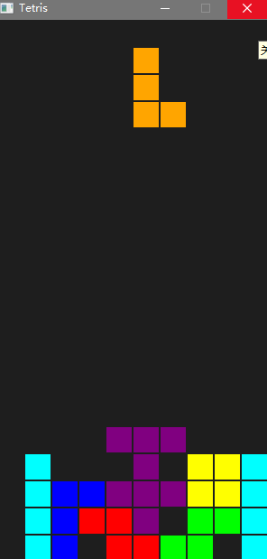
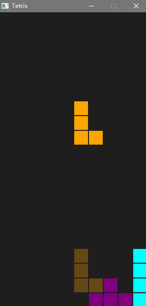

# Tetris SDL2

一个基于 **SDL2 + C++17** 的经典俄罗斯方块游戏，采用组件化的 Actor 架构，支持幽灵块预览、硬降、软降等现代方块游戏特性。



## 特性

- **固定时间步长游戏循环**：逻辑更新与渲染帧率解耦，确保软降/硬降速度稳定，不受帧率波动影响
- **输入系统双模式**：边缘触发（A/D/W/空格）与持续触发（S 软降），通过 SDL_GetKeyboardState 状态检测实现
- **幽灵块预计算缓存**：移动/旋转时预计算下落到底位置并缓存，避免硬降与绘制时重复碰撞检测
- **Actor 架构**：Game 统一调度 Board/Piece 生命周期，构造自动注册、析构自动注销
- **跨平台构建**：CMake + MinGW，支持 Windows/Linux 编译

## 技术栈

| 项目           | 说明                 |
| -------------- | -------------------- |
| 平台           | Windows              |
| 图形/输入/窗口 | SDL2                 |
| 构建工具       | CMake 4.3.2          |
| 编译器         | MinGW-w64 g++ 16.1.0 |

## 项目结构

```text
tetris-sdl2/
├── CMakeLists.txt      # CMake 构建配置
└── Src/
    ├── Main.cpp        # 程序入口
    └── Game/
        ├── Game.h/.cpp     # 游戏主循环与 Actor 管理
        ├── Actor.h/.cpp    # 游戏对象基类
        ├── Board.h/.cpp    # 棋盘、碰撞检测、消行
        └── Piece.h/.cpp    # 当前下落方块、输入、旋转、幽灵块
```

## 快速开始

### 环境要求

- Windows / Linux / macOS
- 安装 [CMake](https://cmake.org/download/) 与 C++ 编译器
- 下载 [SDL2 开发库](https://github.com/libsdl-org/SDL/releases)，并确保路径与 `CMakeLists.txt` 中的 `SDL2_DIR` 一致

> **注意**：当前 `CMakeLists.txt` 中硬编码了 Windows 路径 `D:/SDL2`，请根据你的实际环境修改。

### 构建（Windows MinGW）

```bash
cmake -G "MinGW Makefiles" -B build
cmake --build build
```

### 运行

构建完成后，`SDL2.dll` 会通过 `CMakeLists.txt` 中的 `add_custom_command` 自动复制到 `build/` 目录，然后执行：

```bash
./build/tetris.exe
```

## 操作说明

| 按键      | 功能             |
| --------- | ---------------- |
| `A`     | 左移             |
| `D`     | 右移             |
| `S`     | 软降（加速下落） |
| `W`     | 顺时针旋转       |
| `Space` | 硬降             |
| `Esc`   | 退出游戏         |

## 架构设计

### 主循环

```
ProcessInput() -> UpdateGame() -> GenerateOutput()
```

`Game` 类负责 SDL 初始化、固定帧率主循环以及 Actor 生命周期的统一管理。

### Actor 模式

`Actor` 作为所有游戏对象的基类，提供三个核心虚函数：

- `Update(float deltaTime)` —— 每帧更新逻辑
- `ProcessInput(const uint8_t* keyState)` —— 处理输入
- `Draw(SDL_Renderer* renderer)` —— 渲染

`Actor` 构造时自动注册到 `Game`，析构时自动注销，避免手动管理对象列表。

### Board & Piece

- **Board**：使用 `mGrid` 记录已锁定方块，负责碰撞检测、行消除与棋盘重置
- **Piece**：维护当前下落方块的 4 个格子坐标，处理玩家输入、自动下落、旋转与幽灵块计算

### 幽灵块与硬降

`Piece` 在生成、移动或旋转后调用 `CalculateGhost()` 预计算底部投影，并缓存到 `mGhost` 中。硬降时直接复用该结果，避免重复碰撞检测：

```cpp
if(Space && !mPrevSpace){
    for(int i = 0; i < 4; ++i) mBlocks[i] = mGhost[i];
    board->Lock(mBlocks, mType);
    board->ClearLines();
    Spawn();
}
```



## 注意事项

1. **SDL2 路径**：`CMakeLists.txt` 中 `set(SDL2_DIR D:/SDL2)` 为 Windows 默认安装路径，构建前请确认或修改。
2. **SDL2.dll**：构建后会通过 CMake 后处理命令自动复制到 `build/` 目录；若路径不同，请修改 `CMakeLists.txt` 中的 `add_custom_command`。
3. **主函数**：`Main.cpp` 中使用 `#undef main` 取消 SDL 对 `main` 的宏重定义，保证跨平台兼容。
4. **游戏结束**：当前实现为棋盘满时自动清空重置，未做记分与等级系统，可作为后续扩展方向。