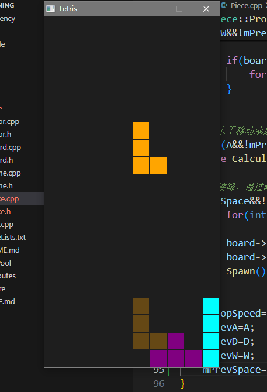

# 俄罗斯方块
## 介绍
基于SDL2实现的经典俄罗斯方块游戏，包含移动、降落、消除等基本功能。

## 技术栈
使用C++语言编写，借助SDL2接口实现游戏基本功能，并采用CMake工具编译。

## 代码实现
### 基本架构
Game类实现游戏的初始化、循环和退出。而游戏的循环有包括输入处理、游戏更新以及图形渲染。
```cpp
public:
bool Initialize();
void RunLoop();
void Shutdown();
private:
void ProcessInput();
void UpdateGame();
void GenerateOutput();
```
Actor类对游戏对象进行管理和实现。通过虚函数的方式，实现多态。
```cpp
public:
virtual void Update(float deltaTime);
virtual void ProcessInput(const uint8_t* keyState);
virtual void Draw(SDL_Renderer* renderer);
```
在Game类中还会提供Actor对象的增删方法，并在Actor对象构造和析构的时候调用，实现资源的自动管理。
```cpp
void AddActor(class Actor* actor);
void RemoveActor(class Actor* actor);
```
```cpp
Actor::Actor(Game* game)
:mGame(game)
{
    mGame->AddActor(this);
}

Actor::~Actor(){
    mGame->RemoveActor(this);
}
```
### 逻辑实现
游戏可拆分为两个部分，Board作为背景，Piece作为玩家操作的方块。
#### Board
Board作为背景，即已经固定的方块，不需要一直更新，但需要一直绘制。通过mGrid标记已经固定的方块，并设置相应的颜色编号，共7种颜色。
```cpp
public:
void Draw(SDL_Renderer* renderer) override;
private:
std::vector<std::vector<int>> mGrid;
const SDL_Color mColors[7];
```
Board还需实现基本功能，即碰撞检测、消除行、重置等等。
```cpp
bool IsValid(const Vector2 blocks[4]) const;
void Lock(const Vector2 blocks[4], int type);
void ClearLines();
void Reset();
```
碰撞检测借助mGrid查看Piece传入的下一帧blocks所在处是否超界，或与mGrid标记的地方（即锁住的方块）重合。
```cpp
bool Board::IsValid(const Vector2 blocks[4]) const {
    for(int i=0;i<4;++i){
        if(blocks[i].x<0||
           blocks[i].x>=mColumns||
           blocks[i].y>=mRows) return false;
        if(blocks[i].y>=0&&
           mGrid[blocks[i].y][blocks[i].x]!=-1) return false;
    }
    return true;
}
```
方块的锁定则直接将blocks在mGrid上标记即可。
```cpp
void Board::Lock(const Vector2 blocks[4], int type){
    for(int i=0;i<4;++i){
        if(blocks[i].y>=0) mGrid[blocks[i].y][blocks[i].x]=type;
    }
}
```
当行满时，进行消除并将上面的行向下移。通过erase删除对应行，并将开头插入一行空值。
```cpp
void Board::ClearLines(){
    for(int y=mRows-1;y>=0;--y){
        bool full=true;
        for(int x=0;x<mColumns;++x){
            if(mGrid[y][x]==-1){
                full=false;
                break;
            }
        }
        if(full){
            mGrid.erase(mGrid.begin()+y);
            mGrid.insert(mGrid.begin(), std::vector<int>(mColumns, -1));
            ++y;
        }
    }
}
```
重置则清空mGrid即可，使用assign重新赋值。
```cpp
void Board::Reset(){
    mGrid.assign(mRows, std::vector<int>(mColumns, -1));
}
```
#### Piece
Piece作为玩家控制的方块，需要对输入进行处理，还需要一直更新并绘制。
```cpp
void Update(float deltaTime) override;
void ProcessInput(const uint8_t* keyState) override;
void Draw(SDL_Renderer* renderer) override;
```
Piece由mBlocks构成，其不同的值对应不同的形状，从常量SHAPES直接获取。
```cpp
const Vector2 SHAPES[7][4]={
    {{0,-1},{0,0},{0,1},{0,2}},
    {{-1,0},{0,0},{1,0},{0,1}},
    {{0,0},{1,0},{0,1},{1,1}},
    {{0,-1},{0,0},{0,1},{1,1}},
    {{0,-1},{0,0},{0,1},{-1,1}},
    {{1,0},{0,0},{0,1},{-1,1}},
    {{-1,0},{0,0},{0,1},{1,1}}
};
```
Piece在绘制时，可通过GetGame()->GetBoard()获取Board对象，然后通过GetColors获取对应颜色。
```cpp
const SDL_Color* GetColors() const {return mColors;}
```

## 编译运行
在终端上编译调试程序。
```shell
cmake -G "MinGW Makefiles" -B build
cmake --build build
```
确保build中有SDL2.dll，运行游戏。
```shell
./build/Tetris
```
游戏启动和退出正常，方块的移动、旋转、软降控制正常，方块的锁定和行消除正常，方块生成和绘制正常。运行部分截图如下。


## 新增功能
### 幽灵块与硬降
硬降，即按压空格后，方块直接下落至底。与幽灵块（方块在底下的实时投影）的实现如出一辙。添加私有成员mGhost，并在Spawn调用时以及方块位置角度发生变化时重新计算幽灵块位置。
```cpp
// 计算下落到底的位置（幽灵块）
void Piece::CalculateGhost(Vector2 ghost[4]) const{
    for(int i=0;i<4;++i) ghost[i]=mBlocks[i];

    Board* board=GetGame()->GetBoard();
    while(true){
        Vector2 nxt[4];
        for(int i=0;i<4;++i) nxt[i]={ghost[i].x, ghost[i].y+1};
        if(!board->IsValid(nxt)) break;
        for(int i=0;i<4;++i) ghost[i]=nxt[i];
    }
}
```
```cpp
void Piece::Spawn(){
    // 生成mBlocks...
    
    CalculateGhost(mGhost);     // 提前计算幽灵块位置
}
```
```cpp
// 水平移动或旋转后一次，需重新计算幽灵块
if((A&&!mPrevA)&&(D&&!mPrevD)&&!(W&&!mPrevW));
else CalculateGhost(mGhost);
```
通过提前与减少不必要计算，来提高游戏性能。在硬降与绘制发生时不必重复计算，通过mGhost直接完成。
```cpp
// 硬降，通过幽灵块直接获取降落位置
if(Space&&!mPrevSpace){
    for(int i=0;i<4;++i) mBlocks[i]=mGhost[i];

    board->Lock(mBlocks, mType);
    board->ClearLines();
    Spawn();
}
```
```cpp
// 绘制幽灵块
if(mGhost[i].y<0) continue;     // 如果mGhost[i].y小于0，则mBlocks[i].y也会小于0
SDL_SetRenderDrawBlendMode(renderer, SDL_BLENDMODE_BLEND);  // 混合模式，绘制时与底色混合
SDL_SetRenderDrawColor(renderer, c.r, c.g, c.b, 80);
rc.x=mGhost[i].x*cell+1;
rc.y=mGhost[i].y*cell+1;
rc.w=cell-2;
rc.h=cell-2;
SDL_RenderFillRect(renderer, &rc);
SDL_SetRenderDrawBlendMode(renderer, SDL_BLENDMODE_NONE);   // 恢复正常模式，绘制实体块
```
下面是新增功能部分截图。

